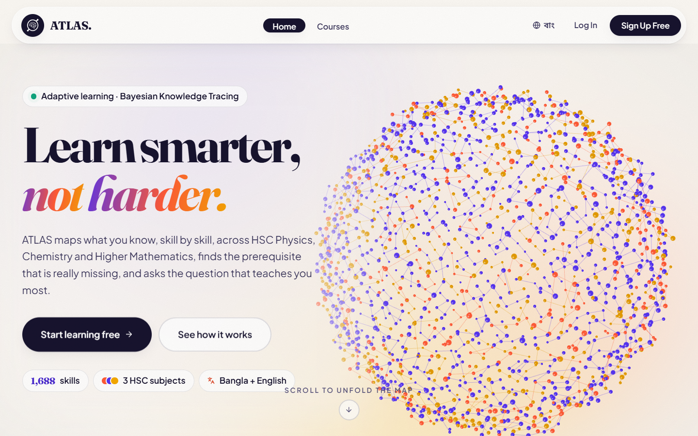
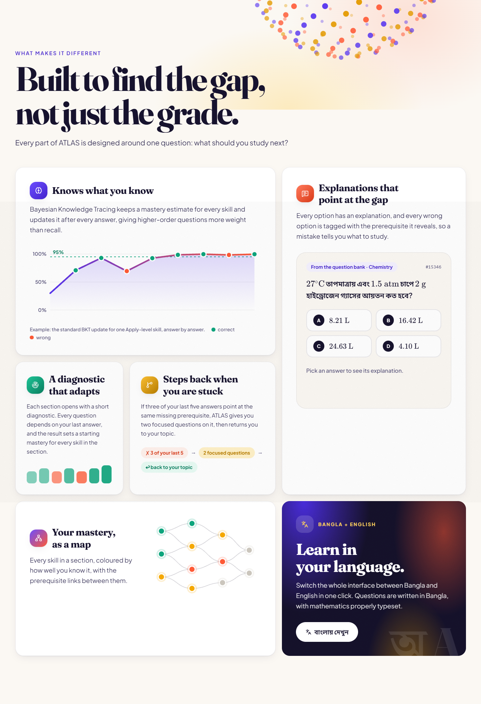
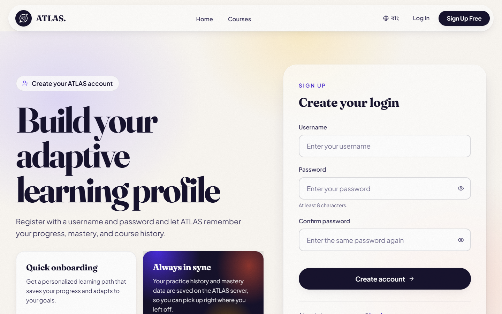

# ATLAS

**Adaptive Tutoring & Learning Assessment System.** ATLAS is an adaptive tutor for
HSC Physics, Chemistry and Higher Mathematics. It estimates mastery skill by skill
with Bayesian Knowledge Tracing, traces mistakes back through a prerequisite graph,
and picks the next question that will teach the learner the most.

**Live demo: [atlas-indol-one.vercel.app](https://atlas-indol-one.vercel.app/)**



## Features

- **Per-skill mastery.** Bayesian Knowledge Tracing updates a mastery estimate after
  every answer, weighting higher Bloom levels more than recall.
- **Prerequisite-aware.** 1,688 skills are linked by 1,683 prerequisite edges. Wrong
  options are tagged with the prerequisite they reveal, and repeated gaps trigger
  short focused practice on that prerequisite.
- **Adaptive diagnostic.** Each section opens with a diagnostic that sets a starting
  mastery for every skill in it.
- **Mastery map.** Every skill is shown coloured by mastery, with the links between
  skills.
- **Bangla + English.** The interface switches language in one click. Questions are
  in Bangla, with LaTeX math rendered by KaTeX.
- **12,000+ verified questions**, generated from six textbooks by a retrieval-grounded
  Gemini pipeline and independently re-solved before loading.



## Tech stack

| Part | Stack |
|---|---|
| Frontend | React 18, Vite, Tailwind CSS, Three.js, Cytoscape, KaTeX |
| Backend | FastAPI (Python), BKT engine over a skill DAG, scrypt passwords + JWT |
| Database | Supabase (Postgres) |
| Content pipeline | Python, RAG over the textbooks, Gemini generation and verification |
| Hosting | Vercel (frontend), Render (API) |

## Run locally

You need Python 3.11+, Node 18+, and a `Backend/.env` file containing
`SUPABASE_URL`, `SUPABASE_SERVICE_KEY` and `AUTH_SECRET`.

```bash
# API: http://localhost:8000
cd Backend
python -m venv .venv && source .venv/bin/activate   # Windows: .venv\Scripts\activate
pip install -r requirements.txt
uvicorn server:app --reload --port 8000

# Frontend: http://localhost:5173 (separate terminal)
cd Frontend
npm install
npm run dev
```

The engine test needs no database or credentials:

```bash
python Backend/smoke_test_engine.py   # expect: 54 passed, 0 failed
```



## Repository layout

```
Backend/     FastAPI API and BKT engine (server.py, auth.py, mastery_updater.py, ...)
Frontend/    React SPA
data-gen/    Offline question-bank generation pipeline
Ontology/    Skill ontology built from the textbook corpus
documents/   Source textbooks used for question generation
```

## Documentation

- [ARCHITECTURE.md](ARCHITECTURE.md): architecture, API reference, data model and
  known limitations
- [DEPLOY.md](DEPLOY.md): deploying to Vercel and Render
- [BKT-DAG Policy For Skill Mastery.txt](BKT-DAG%20Policy%20For%20Skill%20Mastery.txt):
  the exact mastery and gating rules
