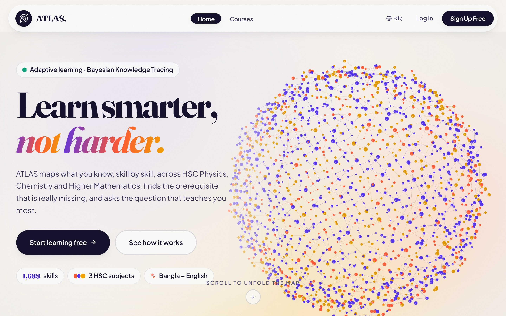

<div align="center">

# ATLAS

**Learn smarter, not harder.**

Adaptive tutoring for HSC Physics, Chemistry and Higher Mathematics,<br>
built on Bayesian Knowledge Tracing over a prerequisite skill graph.

<a href="https://atlas-indol-one.vercel.app/"></a>

**1,688** skills &nbsp;·&nbsp; **1,683** prerequisite links &nbsp;·&nbsp; **51** sections &nbsp;·&nbsp; **12k+** questions

<br>

<a href="https://atlas-indol-one.vercel.app/"></a>

</div>

## How it works

| Step | What ATLAS does |
|---|---|
| **Diagnose** | A short adaptive diagnostic sets a starting mastery for every skill in a section. |
| **Track** | Each answer updates that skill's mastery. A correct answer also lifts the skills it depends on. |
| **Step back** | When 3 of the last 5 wrong answers point to the same missing prerequisite, it asks 2 questions on that skill, then returns to the topic. |
| **Map** | Every skill is shown coloured by mastery, with the links between them. |

Questions are in Bangla with LaTeX math, generated from six textbooks and independently
re-solved before being kept.

## Run locally

Create `Backend/.env` with `SUPABASE_URL`, `SUPABASE_SERVICE_KEY` and `AUTH_SECRET`, then:

```bash
# API, http://localhost:8000
cd Backend && pip install -r requirements.txt && uvicorn server:app --reload
```

```bash
# App, http://localhost:5173
cd Frontend && npm install && npm run dev
```

```bash
# Engine test, no database needed
python Backend/smoke_test_engine.py
```

## Repository

| Path | Contents |
|---|---|
| `Backend/` | FastAPI API, BKT engine, auth |
| `Frontend/` | React + Vite app |
| `data-gen/` | Question generation pipeline |
| `Ontology/` | Skill ontology built from the textbooks |

<div align="center">


<sub><a href="ARCHITECTURE.md">Architecture</a> · <a href="BKT-DAG%20Policy%20For%20Skill%20Mastery.txt">Mastery rules</a></sub>

</div>
